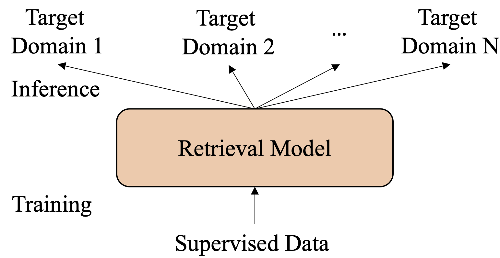
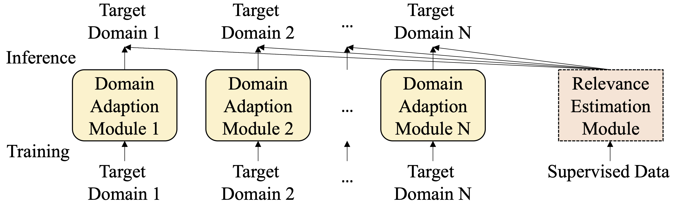
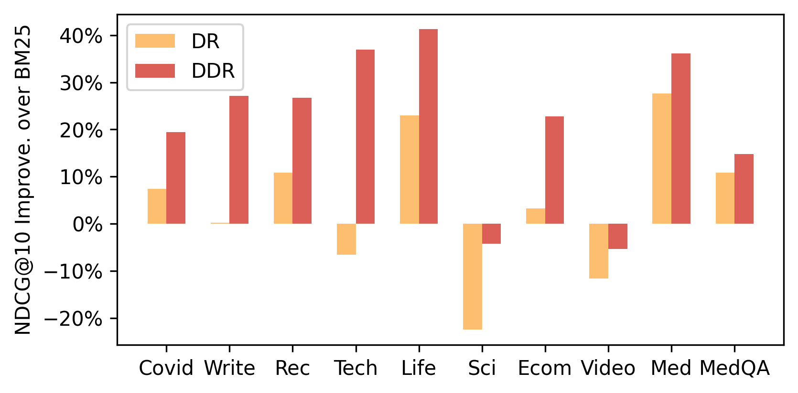
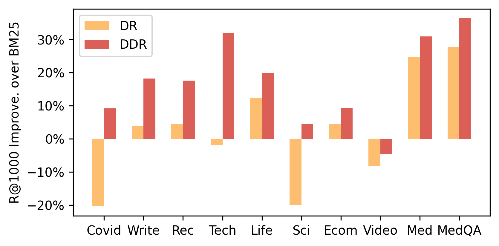
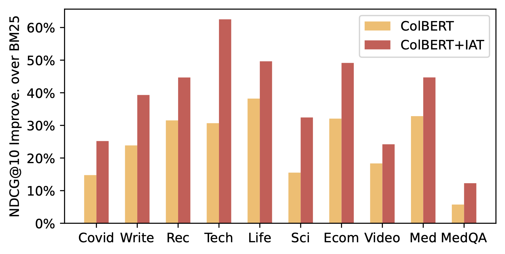
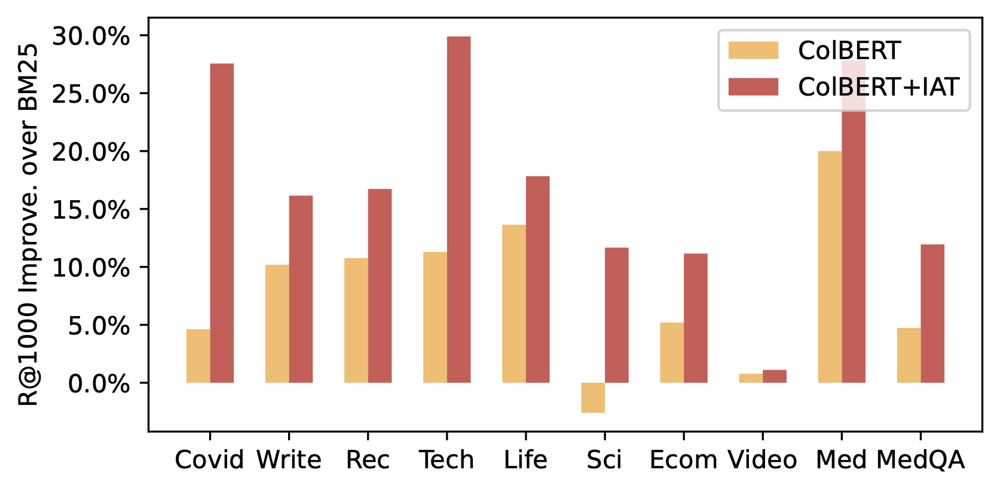

# Inversed Adapter Tuning

<p align="left">
    
    </a>
    
    </a>
    <a>
    
    </a>
    </a>
</p>

This is the official repo for our paper: Inversed Adapter Tuning For Neural-Ranking-as-a-Service. IAT is a novel paradigm that supports effective and flexible domain adaptation for neural ranking models including Dense Retrieval, uniCOIL, SPLADE, ColBERT, and BERT re-ranker.

## Features

- *One command for unsupervised and effective domain adaption.*
- *One command for effective few-shot domain adaption.*
- Various ranking architectures, including Dense Retrieval, uniCOIL, SPLADE, ColBERT, and BERT re-ranker. 
- Two source-domain finetuning methods, contrastive finetuning and distillation. 
- Huggingface-style training and inference, supporting multi-gpus, mixed precision, etc.


## Quick Links

- [Quick Tour](#quick-tour)
- [Installation](#installation)
- [Released Models](#released-models)
- [Example Usage](#example-usage)
- [Preparing Datasets](#preparing-datasets)
- [Zero-shot Domain Adaption](#zero-shot-domain-adaption)
- [Learning Generic Relevance Estimation Ability](#learning-generic-relevance-estimation-ability)
- [Reproducing Results with Released Checkpoints](#reproducing-results-with-released-checkpoints)
- [Training Vanilla Neural Ranking Models](#training-vanilla-neural-ranking-models)
    

## Quick Tour

Neural Ranking models are vulnerable to domain shift: the trained models may even perform worse than traditional retrieval methods like BM25 in out-of-domain scenarios.

In this work, we propose **Inversed Adapter Tuning (IAT)** to support effective and flexible domain adaptation. 
IAT consists of a servide model for modeling domain-invariant matching patterns and several domain plugins for modeling domain-specific features of multiple target corpora. 
DNR enables a flexible training paradigm in which the service model is trained by vendors and domain plugins are trained by customers. 

Neural Ranking   |  Inversed Adapter Tuning
:-------------------------:|:-------------------------:
  |  

The idea of IAT can date back to classic retrieval models in the pre-neural-ranking era. BM25 utilizes the same formula for estimating relevance scores across domains but measures word importance with corpus-specific IDF values. 
However, it does not exist in vanilla neural ranking models where the abilities of relevance estimation and domain modeling are jointly learned during training and entangled within the model parameters. 

Here are two examples when we apply IAT for domain adaption. We plot the figure where y-axis shows the relative improvement over BM25 and x-axis shows different out-of-domain test sets.
<!-- The ranking performance of Dense Retrieval (DR) with and without IAT is shown below.  
NDCG@10   |  Recall@1000
:-------------------------:|:-------------------------:
 |   -->
The ranking performance of ColBERT with and without IAT is shown below. 
NDCG@10   |  Recall@1000
:-------------------------:|:-------------------------:
 |  

IAT brings amazing out-of-domain performance gains!
More details are available in our paper.

## Installation

This repo is developed with [PyTorch]((https://pytorch.org/get-started/locally/)) and [Faiss](https://github.com/facebookresearch/faiss/blob/main/INSTALL.md). They should be installed manually due to the requirement of platform-specific custom configuration. In our development, we run the following commands for installation.
```bash
# XX.X is a placeholder for cudatoolkit version. It should be specified according to your environment
conda install pytorch torchvision torchaudio cudatoolkit=XX.X -c pytorch 
conda install -c conda-forge faiss-gpu
```

After these, now you can install from our code: 
```bash
git clone https://github.com/anonymous-blind-review/Inversed-Adapter-Tuning.git
cd disentangled-retriever
pip install .
```
For development, use
```
pip install --editable .
```

## Released Models

We release about 50 models to facilitate reproducibility and reusage. You do not have to manually download these. **They will be automatically downloaded at runtime.**


<details>
  <summary> Relevance Estimation Modules for Dense Retrieval (<i>click to expand</i>)</summary>

The links cannot be shared becaue of double-blind-review policy. 

- (English) Contrastively trained on MS MARCO Passage Ranking: 
- (English) Knowledge distilled on MS MARCO Passage Ranking: 
- (Chinese) Contrastively trained on Dureader: 
- (Chinese) Knowledge distilled on Dureader: 

</details>

<details>
  <summary> Relevance Estimation Modules for UniCOIL (<i>click to expand</i>)</summary>

The links cannot be shared becaue of double-blind-review policy. 

- (English) Contrastively trained on MS MARCO Passage Ranking: 
- (English) Knowledge distilled on MS MARCO Passage Ranking: 
- (Chinese) Contrastively trained on Dureader: 
- (Chinese) Knowledge distilled on Dureader: 

</details>

<details>
  <summary> Relevance Estimation Modules for SPLADE (<i>click to expand</i>)</summary>

The links cannot be shared becaue of double-blind-review policy. 

- (English) Contrastively trained on MS MARCO Passage Ranking: 
- (English) Knowledge distilled on MS MARCO Passage Ranking: 
- (Chinese) Contrastively trained on Dureader: 
- (Chinese) Knowledge distilled on Dureader: 

</details>

<details>
  <summary> Relevance Estimation Modules for ColBERT (<i>click to expand</i>)</summary>

The links cannot be shared becaue of double-blind-review policy. 

- (English) Contrastively trained on MS MARCO Passage Ranking: 
- (English) Knowledge distilled on MS MARCO Passage Ranking: 
- (Chinese) Contrastively trained on Dureader: 
- (Chinese) Knowledge distilled on Dureader: 

</details>

<details>
  <summary> Relevance Estimation Modules for BERT re-ranker (<i>click to expand</i>)</summary>

The links cannot be shared becaue of double-blind-review policy. 

- (English) Trained on MS MARCO Passage Ranking: 
- (Chinese) Trained on Dureader: 

</details>

<details>
  <summary> Domain Adaption Modules for various datasets  (<i>click to expand</i>)</summary>

The links cannot be shared becaue of double-blind-review policy. 

- Trained on English test sets (Masked Language Modeling)
    - Trained on MS MARCO Passage corpus: 
    - Trained on TREC-Covid corpus: 
    - Trained on Lotte-Writing corpus: 
    - Trained on Lotte-Recreation corpus: 
    - Trained on Lotte-Technology corpus: 
    - Trained on Lotte-Lifestyle corpus: 
    - Trained on Lotte-Science corpus: 
- Trained on Chinese test sets (Masked Language Modeling)
    - Trained on Dureader corpus: 
    - Trained on CPR-Ecommerce corpus: 
    - Trained on CPR-Video corpus: 
    - Trained on CPR-Medical corpus: 
    - Trained on cMedQAv2 corpus: 
    
</details>


Besides IAT models, we also release the vanilla/traditional neural ranking models, which are baselines in our paper.
<details>
  <summary> Vanilla Neural Ranking Checkpoints (<i>click to expand</i>)</summary>

<details>
  <summary> Vanilla Dense Retrieval (<i>click to expand</i>)</summary>

The links cannot be shared becaue of double-blind-review policy. 

- (English) Contrastively trained on MS MARCO Passage Ranking: 
- (English) Knowledge distilled on MS MARCO Passage Ranking: 
- (Chinese) Contrastively trained on Dureader:
- (Chinese) Knowledge distilled on Dureader: 


</details>

<details>
  <summary> Vanilla uniCOIL (<i>click to expand</i>)</summary>

The links cannot be shared becaue of double-blind-review policy. 

- (English) Contrastively trained on MS MARCO Passage Ranking: 
- (English) Knowledge distilled on MS MARCO Passage Ranking: 
- (Chinese) Contrastively trained on Dureader: 
- (Chinese) Knowledge distilled on Dureader: 

</details>

<details>
  <summary> Vanilla SPLADE (<i>click to expand</i>)</summary>

The links cannot be shared becaue of double-blind-review policy. 

- (English) Contrastively trained on MS MARCO Passage Ranking: 
- (English) Knowledge distilled on MS MARCO Passage Ranking: 
- (Chinese) Contrastively trained on Dureader: 
- (Chinese) Knowledge distilled on Dureader: 

</details>

<details>
  <summary> Vanilla ColBERT (<i>click to expand</i>)</summary>

The links cannot be shared becaue of double-blind-review policy. 

- (English) Contrastively trained on MS MARCO Passage Ranking: 
- (English) Knowledge distilled on MS MARCO Passage Ranking: 
- (Chinese) Contrastively trained on Dureader: 
- (Chinese) Knowledge distilled on Dureader: 

</details>

<details>
  <summary> Vanilla BERT re-ranker (<i>click to expand</i>)</summary>

The links cannot be shared becaue of double-blind-review policy. 

- (English) Trained on MS MARCO Passage Ranking: 
- (Chinese) Trained on Dureader:

</details>


</details>
*Note: Our code also supports training and evaluating vanilla neural ranking models!*

## Example usage:

Here is an example about using disentangled dense retrieval for ranking. The service model is generic, while the domain plugin is domain-specifically trained to mitigate the domain shift. The two modules are assembled during inference.
```python
from transformers import AutoConfig, AutoTokenizer
from disentangled_retriever.dense.modeling import AutoDenseModel

# This is the service model contrastively trained on MS MARCO
# It can be used in various English domains.
service_model_URL = "path/to/service_model"
## For example, we will apply the model to TREC-Covid dataset. 
# Here is the domain plugin for this dataset.
domain_plugin_NAME = "path/to/domain_plugin"

## Load the modules
config = AutoConfig.from_pretrained(domain_plugin_NAME)
config.similarity_metric, config.pooling = "ip", "average"
tokenizer = AutoTokenizer.from_pretrained(domain_plugin_NAME, config=config)
model = AutoDenseModel.from_pretrained(domain_plugin_NAME, config=config)
adapter_name = model.load_adapter(service_model_URL)
model.set_active_adapters(adapter_name)
model.merge_lora(adapter_name)

## Let's try to compute the similarities
queries  = ["When will the COVID-19 pandemic end?", "What are the impacts of COVID-19 pandemic to society?"]
passages = ["It will end soon.", "It makes us care for each other."]
query_embeds = model(**tokenizer(queries, return_tensors="pt", padding=True, truncation=True, max_length=512))
passage_embeds = model(**tokenizer(passages, return_tensors="pt", padding=True, truncation=True, max_length=512))

print(query_embeds @ passage_embeds.T)
```
Results are:
```python
tensor([[107.6821, 101.4270],
        [103.7373, 105.0448]], grad_fn=<MmBackward0>)
```

## Preparing datasets

We will use various datasets to show how disentangled modeling facilitates flexible domain adaption. Before the demonstration, please download and preprocess the corresponding datasets. Here we provide detailed instructions:

- [Preparing English training data and out-of-domain test sets](./examples/prepare_dataset/english-marco/README.md)
- [Preparing Chinese training data and out-of-domain test sets](./examples/prepare_dataset/chinese-dureader/README.md)


## Zero-shot Domain Adaption

Suppose you already have a service model (trained by yourself or provided by us) and you need to adapt the model to an unseen domain. To do this, just train a domain plugin to mitigate the domain shift. 

The training process is completely unsupervised and only requires the target-domain corpus. Each line of the corpus file should be formatted as `id doc' separated by tab. Then you can train a domain plugin model with only one command. 
```bash
python -m torch.distributed.launch --nproc_per_node 4 \
    -m disentangled_retriever.adapt.run_adapt_with_mlm \
    --corpus_path ... ... ...
```
The trained domain plugin can be combined with different service models and formalize a well-performing neural ranking models. We provide many service models (see this [section](#released-models)) that correspond to different ranking methods or are trained with different losses. The trained domain plugin can be combined with any service model to become an effective ranking model, e.g., a Dense Retrievla model or a ColBERT model. 
For example, if you want to acquire a dense retrieval model, use the following command for inference:
```bash
python -m torch.distributed.launch --nproc_per_node 4 \
    -m disentangled_retriever.dense.evaluate.run_eval \
    --backbone_name_or_path [path-to-the-trained-plugin] \
    --adapter_name_or_path [path-to-the-dense-retrieval-service] \
    --corpus_path ... --query_path ... ... ...
```
If you want to acquire a ColBERT model, use the following command for inference:
```bash
python -m torch.distributed.launch --nproc_per_node 4 \
    -m disentangled_retriever.colbert.evaluate.run_eval \
    --backbone_name_or_path [path-to-the-trained-plugin] \
    --adapter_name_or_path [path-to-the-dense-retrieval-service] \
    --corpus_path ... --query_path ... ... ...
```

We give two adaption examples. They train a separate domain plugin in the target domain and re-use our released service models. 
- [Adapting to an English dataset](./examples/domain_adapt/english-marco/adapt_to_new_domain.md)
- [Adapting to a Chinese dataset](./examples/domain_adapt/chinese-dureader/adapt_to_new_domain.md)

Please try these examples before using our methods on your own datasets.

## Learning Generic Relevance Estimation Ability

We already release a bunch of service models for various kinds of ranking methods. You can directly adopt these public checkpoints. 
But if you have some private labeled data and want to train a service model on it, here we provide instructions on how to do this.

To directly use this codebase for training, you need to convert your dataformat as follows
- corpus.tsv: corpus file. each line is `docid doc' separated by tab.
- query.train: training queries. each line is `qid query' separated by tab.
- qrels.train: annotations. each line is `qid 0 docid rel_level' separated by tab. 
- [Optional] hard negative file for contrastive training: each line is `qid   neg_docid1 neg_docid2 ...'. qid and neg_docids are separated by tab. neg_docids are separated by space.
- [Optional] soft labels for knowledge distillation: a pickle file containing a dict: {qid: {docid: score}}. It should contain the soft labels of positive pairs and of several negative pairs.

If you still have questions about the data formatting, you can check [how we convert MS MARCO](./examples/prepare_dataset/english-marco/README.md#ms-marco-passage-ranking).

With formatted supervised data, now you can train a service model. We use a disentangled finetuning trick: first training a source domain plugin module to capture domain-specific features and then training the service model to learn domain-invariant matching patterns. 

Here we provide instructions about training service models for different ranking methods.
- Train service model for Dense Retrieval: [on English MS MARCO](./examples/dense/english-marco/train_rem.md) | [on Chinese Dureader](./examples/dense/chinese-dureader/train_rem.md)
- Train service model for uniCOIL: [on English] [on Chinese] (coming soon)
- Train service model for SPLADE: [on English] [on Chinese] (coming soon) 
- Train service model for ColBERT: [on English] [on Chinese] (coming soon)
- Train service model for BERT re-ranker: [on English] [on Chinese] (coming soon)

## Reproducing Results with Released Checkpoints

We provide commands for reproducing the various results in our [paper](https://arxiv.org/pdf/2208.05753.pdf).
- Evaluating Disentangled Dense Retrieval
  - [Evaluating Disentangled Dense Retrieval on English out-of-domain datasets](./examples/dense/english-marco/inference.md)
  - [Evaluating Disentangled Dense Retrieval on Chinese out-of-domain datasets](./examples/dense/chinese-dureader/inference.md)
- Evaluating Disentangled uniCOIL
  - [Evaluating Disentangled Dense Retrieval on English out-of-domain datasets](./examples/unicoil/english-marco/inference.md)
  - [Evaluating Disentangled Dense Retrieval on Chinese out-of-domain datasets](./examples/unicoil/chinese-dureader/inference.md)


<!-- ### Generic Relevance Estimation: Training REM 

Relevance Estimation Module (REM) is only required to trained once. In our paper, we use MS MARCO as English training data and use Dureader as Chinese training data. We also explore two finetuning methods. The commands are provided. You can also use your own supervised data to train a REM module. 

- [Training REM on MS MARCO](./examples/dense-mlm/english-marco/train_rem.md)
    - Disentangled Finetuning
    - Hard negatives, contrastive loss. or Cross-encoder scores, Margin-MSE loss.
- [Training REM on Dureader](./examples/dense-mlm/chinese-dureader/train_rem.md)
    - Disentangled Finetuning
    - Inbatch negatives, contrastive loss.

### Unsupervised Domain Adaption: Training DAM

With a ready REM module, Domain Adaption Module (DAM) is trained unsupervisedly for each target domain to mitigate domain shift. In the following, we give examples about how to adapt to an unseen English/Chinese domain. Note that we suppose the REM module is ready and directly load the trained REM module. 

- [Adapting to an unseen English domain](./examples/dense-mlm/english-marco/adapt_domain.md)
    - Unsupervised Adaption yet high effectiveness.
    - Take Lotte-Technology as an example.
- [Adapting to an unseen Chinese domain](./examples/dense-mlm/chinese-dureader/adapt_domain.md)
    - Unsupervised Adaption yet high effectiveness.
    - Take CPR-Ecommerce as an example. -->

## Training Vanilla Neural Ranking Models

This powerful codebase not only supports Disentangled Neural Ranking, but also vanilla Neural Ranking models. You can easily reproduce state-of-the-art Dense Retrieval, uniCOIL, SPLADE, ColBERT, and BERT rerankers using this codebase! The instructions are provided as below.

- Dense Retrieval
  - [Training Dense Retrieval models on MS MARCO](./examples/dense/english-marco/train_baseline.md)
  - [Training Dense Retrieval models on Dureader](./examples/dense/chinese-dureader/train_baseline.md)
  - [Evaluating Dense Retrieval models on English out-of-domain datasets](./examples/dense/english-marco/inference_baseline.md)
  - [Evaluating Dense Retrieval models on Chinese out-of-domain datasets](./examples/dense/chinese-dureader/inference_baseline.md)


## Citation
If you find our work useful, please consider citing us.